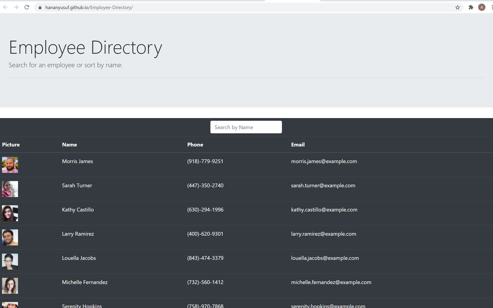

# Employee-Directory

## Description

This is a React application that allows users to be able to view employee directory at once and gives them a quick access to their information. In addition, the user is able to filter/search employees by name and sort the table by name alphabetically. 

## Table of Contents

* [Built With](#builtwith)
* [Usage](#usage)
* [contributing](#credits)
* [Issues](#issues)
* [Questions](#questions)

## Built With
 The program is built with React and NodeJS.

## Usage
To run this application locally, Install the dependencies. Run `npm start` on your terminal to compile and start the server. The deployed app can be found [Here]( https://hananyusuf.github.io/Employee-Directory/)

## Contribution

When contributing to this repository, please first discuss the change you wish to make via issue, email, or any other method with the owners of this repository before making a change.

## Issues

Feel free to submit issues and enhancement requests.

## Questions?

For any questions you may have, feel free to find me via the information provided below:

Email:
afetyusuf.gggnc@gmail.com

[Github Page](https://github.com/HananYusuf/)
HananYusuf

